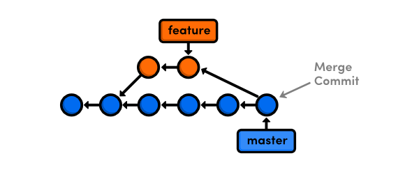
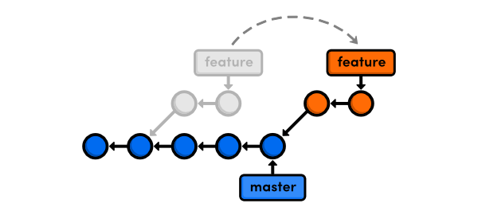
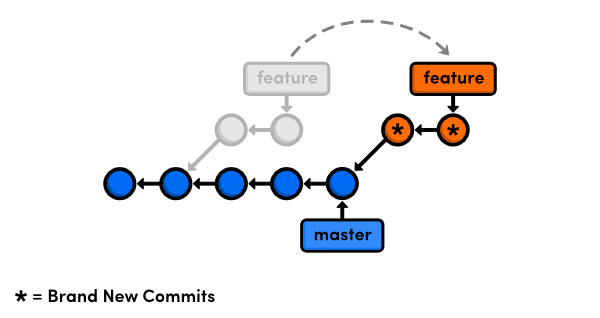

---
puppeteer:
    pdf:
        format: letter
        displayHeaderFooter: true
        margin:
            top: 2cm
            right: 0.5cm
            bottom: 2cm
            left: 0.5cm
    image:
        quality: 90
        fullPage: true
    
---

:::: container
:::text-center
# `Git`{style="color:orange"}
:::
::::

</br>

::::
:::text-right alert alert-secondary
## Guías de estudio
:::
::::

</br>

### `Guía rápida`{style="color:orangeRed"}

</br>
===

#### `Paso a paso (lo más básico - trabajo inicial)`{style="color:green"}
Resumen de trabajo inicial.

Se recomienda antes de iniciar, en caso de ser nuevo proyecto, crear primero el repositorio en Github, en caso contrario clonarlo (explicado en la guía completa).

1. iniciar el repositorio

`git init`{style="color:white;background:black;padding:10px"}

2. Agregar todos los archivos

`git add .`{style="color:white;background:black;padding:10px"}

3. Confirmar los cambios

`git commit -m "mensaje descriptivo de lo realizado"`{style="color:white;background:black;padding:10px"}

* opcional: en caso de querer crear una nueva rama, de lo contrario se sube al `master`{style="color:blue"}

    `git -M <nuevaRama>`{style="color:white;background:black;padding:10px"}

4. Cargar los archivos al repositorio de github

`git remote add origin <url del repositorio de github>`{style="color:white;background:black;padding:10px"}

Ejemplo:

~~~
    git remote add origin https://github.com/ches2409/etp.git
~~~

5. Subir los archivos al servidor, en este caso a la rama `master`{style="color:blue"}

`git push origin -u master`{style="color:white;background:black;padding:10px"}

<br>
<br>

### `Guía completa de uso`{style="color:orangeRed"}

</br>
===

Guía completa de trabajo con Git

#### Imágen de convenciones


#### `Esquema básico`{style="color:green"}
Git trabaja con [[branch]] (ramas) como manera de separar desarrollos que pueden ir paralelos y que se irán juntando a medida que estén terminados (la rama principal se conoce como `master`{style="color:blue"})

La estructura está compuesta por 3 "arboles" administrador por git:
1. `working directory`{style="color:blue"}(directorio de trabajo):El desarrollo local, contiene todos los archivos del proyecto.
2.  `stage`{style="color:blue"}(index): Zona intermedia, Es el registro donde se añaden los archivos a señalar.
3. `history`{style="color:blue"}(repository): Donde se guardan todos los cambio de los archivos añadidos en el `index`{style="color:blue"}, lo que se conoce como `commit`{style="color:green"}, este apunta al último.


El desarrollo típico se resume en:
1. Trabajar en una `branch`{style="color:blue"} concreta (por lo general la master)
2. A medida que se avanza se van realizando `stage`{style="color:blue"} y `commit`{style="color:blue"} según la necesidad.
3. Cada cierto tiempo se sincroniza con el repositorio `remote`{style="color:blue"}

!!! warning ""
    workflow:
    1. `stage`{style="color:blue"} via `git add`{style="color:green"}
    2. `commit`{style="color:blue"} via `commit -m "mensaje"`{style="color:green"}
    3. `push`{style="color:blue"} via `git push origin master`{style="color:green"}

#### `Crear el repositorio`{style="color:green"}
Con el directorio creado y abierto en el editor, ejecutar:

`git init`{style="color:white;background:black;padding:10px"}

!!! success para tener en cuenta
    para ver el estado de nuestro proyecto se usa el comando:

    `git status`{style="color:white;background:black;padding:10px"}

    archivos [[Untracked]] se encuentran aún en el [[working directory]] falta confirmar


#### `Agregar (add)`{style="color:green"}
Agregar los archivos del [[working directory]] al [[stage]]

`git add <nombreArchivo>`{style="color:white;background:black;padding:10px"}


tambien podemos usar los siguiente

!!! note opcional a \<nombreArchivo\>
    Agregar todos los archivos al [[stage]]
    * git add .
    * git --all
    * git -A

en caso de querer remover el archivo del `stage`{style="color:blue"} y regresarlo al `working`{style="color:blue"}:

```
    git rm --cached <nombreArchivo>
```
para remover por completo el archivo del `stage`{style="color:blue"} y también del `working`{style="color:blue"}:

```
    git rm --f <nombreArchivo>
```
Si el archivo solo se encuentra en el `working`{style="color:blue"} se puede borrar de manera sencilla:
```
    git rm <nombreArchivo>
```
!!! note Nota
    es recomendable para llevar el historial de forma ordenanda, realizar un `commit`{style="color:green"} despues del borrado

#### `Confirmar(commit)`{style="color:green"}
Pasar los archivos del `stage`{style="color:blue"} al [[head]] (repository)

`git commit -m "mensaje descriptivo de lo realizado"`{style="color:white;background:black;padding:10px"}


##### amend

el comando `git --amend`{style="color:green"} es una manera práctica de modificar la confirmación más reciente. Permite combinar los cambios preparados con la confirmación anterior en lugar de crear una confirmación nueva. También puede usarse para editar el mensaje de la confirmación anterior sin cambiar la instantánea.

`git commit --amend "mensaje de cambio"`{style="color:white;background:black;padding:10px"}

para agregar un cambio al commit realizado previamente se usa:

```
    git commit --amend -m "mensaje modificado, remplaza el anterior"
```


#### `versionar o etiquetar (tag)`{style="color:green"}
Para realizar un versionamieto del proyecto se usa la etiqueta [[git tag]]

existen dos tipos de etiquetas:
* Anotadas
* Ligeras
ligeras: la version a etiquetar, Ejemplo

`git tag 0.5`{style="color:white;background:black;padding:10px"}

Anotada: contiene nombre de referencia y la anotación o mensaje, Ejemplo

`git tag -a 0.5 -m "Versión estaple del proyecto"`{style="color:white;background:black;padding:10px"}

para ver los tag's realizados:

```
    git tag -l
```
Con esto etiquetamos el ultimo commit que se realizó.

Para etiquetar versiones pasadas del proyecto, se hace conociendo el [[SHA-1 hash]] del `commit`{style="color:green"}, el cual se copia y se pega al comando:

`git tag <numeroVersion> <SHA-1 hash> `{style="color:white;background:black;padding:10px"}

ejemplo:
    etiqueta ligera
```
    git tag 0.6 8db3310839002cf22f19b412739b613ccd2a38ac
```
para borrar tag:

`git tag -d <numeroVersionABorrar> `{style="color:white;background:black;padding:10px"}

```
    git tag -d 0.6
```

para renombrar tag:

`git tag -f -a <numeroVersionABorrar> -m <"mensaje"> <SHA-1 hash>`{style="color:white;background:black;padding:10px"}

```
    git tag -f -a 0.6 -m "correcion de versión" 8db3310839002cf22f19b412739b613ccd2a38ac
```
luego de esto se borra la version anterior a la que se modificó

```
    git tag -d 0.6
```

#### `historia del proyecto (log)`{style="color:green"}
Con el comando [[git log]] se revisa todos los cambios del proyecto

estructura del log

`linea 1`{style="color:gray"} se muestra el `SHA-1 hash`{style="color:blue"}

`commit 8db3310839002cf22f19b412739b613ccd2a38ac`{style="color:orange"}

`linea 2`{style="color:gray"}
Author: \<nombreAutor\> \<correo electrónico\>

`linea 3`{style="color:gray"}
Date: \<fecha y hora\>

`linea 3`{style="color:gray"}
\<Mensaje del commit\>

El comando `git log`{style="color:green"} se puede personalizar

* resume el log: el `SHA-1 hash`{style="color:blue"} lo muestra en un conjunto de caracteres mas pequeño (se puede usar tambíen para hacer las referencias) e indica el mensaje del commit.

`git log --oneline>`{style="color:white;background:black;padding:10px"}

* mostrar el grafico de como se avanza en la historia

`git log --oneline --graph>`{style="color:white;background:black;padding:10px"}

* hacer log de commit's que se quieran visualizar

`git log -<numeroCommit>`{style="color:white;background:black;padding:10px"}

para cerrar la pantalla del `log`{style="color:green"} en el terminal, basta con presionar la tecla [[Q]]

#### `Diferencias entre versiones (diff)`{style="color:green"}
Para ver los cambios entre los commit se usa el comando [[git diff]]

* estado inicial con el git que se compare:

`git diff <SHA-1 hash>`{style="color:white;background:black;padding:10px"}

* Comparar dos commit's

`git diff <SHA-1 hashUno> <SHA-1 hashDos>`{style="color:white;background:black;padding:10px"}

#### `re-escribir (reset)`{style="color:green"}
para realizar cambios o sobreescribir dentro los commit se usa el comando [[git reset]]

!!! danger para tener en cuenta
    este procedimiento es de cuidado debido a que se rescribe el proyecto y por lo tanto se puede perder cosas del mismo.

hay tres tipos principales de reset
* reset soft
* reset mixed
* reset hard


##### reset soft
Se quita desde un commit a traves su `SHA-1 hash`{style="color:blue"}, dejando el commit al que se hizo referencia por su `hash`{style="color:blue"} en el estado original.

el `soft`{style="color:green"} quita el commit pero no los archivos modificados ni los archivos de `stage`{style="color:blue"}, quedando preparados para hacer nuevamente el `commit`{style="color:green"}

en resumen quita un cambio pero lo mantiene en `stage`{style="color:blue"}


`git reset --soft <SHA-1>`{style="color:white;background:black;padding:10px"}

!!! note Ejemplo de uso
    por medio del `log`{style="color:green"} ubicamos el `hash`{style="color:blue"} a quitar.
    ``` sh
    43f3570 agregado nuevo hero // commit a quitar
    8db3310 agregado el header // hash a llamar
    052f52b inicializar el landing


    git reset --soft 8db3310
    git log --oneline
    

    8db3310 agregado el header
    052f52b inicializar el landing
    ```

##### reset mixed
Descarta cambios, quita los commit's y los archivos del `stage`{style="color:blue"} al contrario de como lo hace `soft`{style="color:green"}, los deeja en el `working directory`{style="color:blue"}, por lo tanto hay que realizar nuevamente el `add`{style="color:green"} y el `commit`{style="color:green"}

`git reset --mixed <SHA-1>`{style="color:white;background:black;padding:10px"}

##### reset hard

Borra todo, tanto commit como archivos del stage y del working directory

* actua dentro del momento en el que se encuentre (dentro del head)

`git reset --hard`{style="color:white;background:black;padding:10px"}

si los archivos solo se encuentran el workig directory y se encuentra en estado `untracked`{style="color:green"} (no han sido usados, recientemente agregados)

* con esta opcion se borra de manera permanente todo lo que interviene en ese commit y no se puede deshacer

`git reset --hard <SHA-1>`{style="color:white;background:black;padding:10px"}

!!! danger para tener encuenta
    en caso de haber borrado con `--hard`{style="color:green"}, la unica forma para volver a ese estado es tener una copia del log y repetir el paso desde el ultimo hash o del que quiere repetir

#### `ramas (branch)`{style="color:green"}

Las ramas son utilizadas para desarrollar funcionalidades aisladas unas de otras. La rama `master`{style="color:blue"} es la rama por defecto cuando se crea un respositorio, se crean nuevas durante el desarrollo y se fusionan a la rama principal cuando este termina.

crear ramas

`git branch <nombreRama>`{style="color:white;background:black;padding:10px"}

para listar ramas (-l , --list)

`git branch --list`{style="color:white;background:black;padding:10px"}

borrar ramas (-d, --delete)
 * no permite borrar cuando hay cambios dentro de ella (commit)

`git branch -d <nombreRama>`{style="color:white;background:black;padding:10px"}

* para forzar el borrado se usa (--delete --force, -D)

`git branch -D <nombreRama>`{style="color:white;background:black;padding:10px"}

renombrar ramas (-m, --move)

`git branch -m <nombreRamaOriginal> <nombreRamaFinal>`{style="color:white;background:black;padding:10px"}


#### `Movimiento entre ramas (checkout)`{style="color:green"}
moverse entre ramas

`git checkout <nombreRama>`{style="color:white;background:black;padding:10px"}

tambien se puede usar el `checkout`{style="color:green"} para moverse entre commit, por medio este podemos movernos a ese commit y revisar como estuve en ese tiempo el proyecto sin borrar nada.(crea la rama virtual con el nombre del SHA-1 hash)

`git checkout <hash>`{style="color:white;background:black;padding:10px"}

crear rama y ubicarse en ella

`git checkout -b <nombreRama>`{style="color:white;background:black;padding:10px"}

#### `Trabajar entre ramas`{style="color:green"}
Una vez terminado el trabajo en cada una de las ramas se procede a realizar la union de todas la ramas.

Ubicarse en la rama que va recibir los cambios (master)

`git merge <ramaAMezclar>`{style="color:white;background:black;padding:10px"}



metodos internos de git a usar en el merge

* `Fast-forward`{style="color:green"}: la rama que se va a unir, parte directamente desde la rama master, continuación directa.

* `Auto-mergin`{style="color:green"}: abre el ditor para confirmar cambios (commit), este tipo de combinacion se da cuando la rama ha partido del master pero ya se han realizado cambios en ella.

* `Auto-merging CONFLICT`{style="color:green"}:Cuando se mezclan con archivos iguales, se revisan los cambios manuales y se deja una version.

#### `reescribir la historia (rebase)`{style="color:green"}
Una alternativa a `merge`{style="color:green"}, en lugar de enlazar ramas con `commit`{style="color:green"} de merge, el `rebase`{style="color:green"} mueve completamente la rama con la nueva característica hacia la punta del `master`{style="color:blue"}



`git rebase <ramaAMezclar>`{style="color:white;background:black;padding:10px"}

Ventajas:

* Resulta en una historia lineal del proyecto
* Oportunidad de limpiar commits locales

contras:
* hace la unión de todas las ramas

!!! danger Para tener en cuenta
    Al no realizarce de manera correcta, puede ser una de las operaciones más peligrosas que se le puede realizar a un repositorio

hacer un rebase no mueve los commits en una nueva rama. En su lugar, crea nuevos commits que contienen los cambios deseados.



Después de hacer un rebase, los commits en `feature`{style="color:orangeRed"} tendrán diferentes hashes. Esto significa que no solo posicionamos una rama —literalmente, reescribimos la historia del proyecto. Esto es un efecto secundario muy importante de `rebase`{style="color:green"}.
##### interactivo (interative rebase -i)

El rebase interactivo deja definir precisamente como cada commit será movido hacia la nueva base.

`git rebase -i <ramaAMezclar>`{style="color:white;background:black;padding:10px"}

De esta manera se confirman las modificaciones (commit), es util para cambiar los mensajes de los commits anteriores así como reorganizar el historial de confirmaciones, equivalente al `--amend`{style="color:green"}.

#### `Cambios temporales (stash)`{style="color:green"}

El comando `stash`{style="color:green"} almacena temporalmente (o guarda en un stash) los cambios que se hayan efectuado en el código en el que se está trabajando. Guardar los cambios en stashes resulta práctico si se tiene que cambiar rápidamente de contexto, y no se tiene listo el código para confirmar los cambios.

`git stash`{style="color:white;background:black;padding:10px"}

al regresar a la rama donde se dejó, se puede hacer una visualización de los stash:

`git stash list`{style="color:white;background:black;padding:10px"}

``` bash:listado-stash
stash@{0}: WIP on <branch>: <hash> <commit>
stash@{1}: WIP on <branch>: <hash> <commit>
```
!!! note ""
    `stash@{#}`{style="color:orangeRed"}: identificador

    `WIP`{style="color:orangeRed"}: Trabajo en curso

se recomienda comentar los `stash`{style="color:green"} con una descripción mediante el comando

`git stash save "comentario del stash"`{style="color:white;background:black;padding:10px"}

* ver las diferencias de un stash

`git stash show"`{style="color:white;background:black;padding:10px"}

Otra opción es utilizar la opción -p (o --patch) para ver todas las diferencias de un stash:

`git stash show -p"`{style="color:white;background:black;padding:10px"}

* eliminar

`git stash drop <identificador>`{style="color:white;background:black;padding:10px"}

* eliminar todos los stash

`git stash clear`{style="color:white;background:black;padding:10px"}

* aplicar el ultimo cambio realizado (stash@{0})  

`git stash apply`{style="color:white;background:black;padding:10px"}

* para aplicar cambio de un determinado stash se invoca su numero de stash:

`git stash apply <identificador>`{style="color:white;background:black;padding:10px"}

* Crear una nueva rama a partir del stash

`git stash branch"`{style="color:white;background:black;padding:10px"}